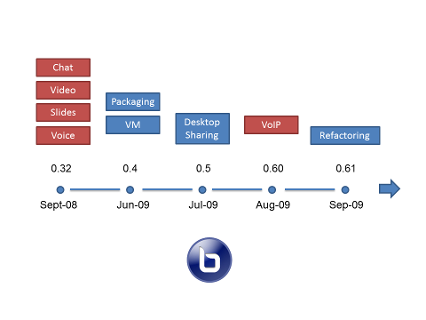
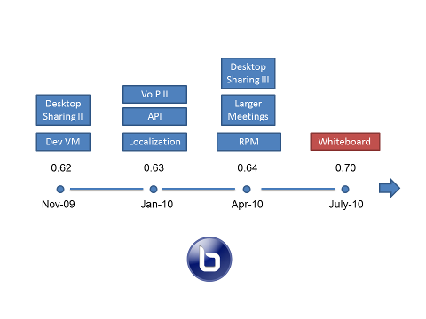
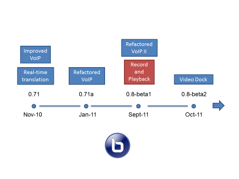
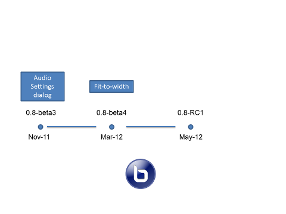

#BigBlueButton

##1. Introduction

## 1.1. Project Overview
BigBlueButton is an open source web conferencing system for online learning.
It looks forward to help students and teachers to collaborate through a web platform. They may share audio, video, presentation (with whiteboard markup), chat and the presenter's desktop in real-time. The users can assume different roles according to their purpose: a **viewer** (student) can chat and send or receive audio and video; a **moderator** can mute or unmute other viewers, lock down viewers, or make anyone (including themselves) the **presenter** that can upload slides and annotate them for all to see.

## 1.2. Road Map
BigBlueButton's **Road Map** is largely driven by its target market: on-line learning. The focus of BBB is to the deliver a world-class product and provide the remote students a high quality learning experience. In order to achieve the proposed goals, BBB works on:
  * **Stability** - doing extensive testing for each release and providing a demo server for weeks without reboot.
  * **Usability** - caring about the human perception, like audio and video quality, or adding new features making the user experience more consistent and elegant.
  * **Modularity** - constantly looking for reducing the coupling between components.
  * **Code Quality** - refactoring and rewriting components as BBB's features set and architecture are extended.
  * **Scalability** - building a highly collaborative environment and avoid making restrictions to the application's usage.
  * **API** - providing a simple API for integration of 3rd party applications and open source projects.

### 1.2.1. Core Features

To improve the BBB's core the following enhancements must be implemented:
 * **Audio** - must have no perceptual voice delay.
 * **Presentation** - support full-screen mode with optional notifications.
 * **Whiteboard** - support ability to move/edit whiteboard objects, multi-user editing and keyboard input.
 * **Users** - add emote icons to user list.
 * **Chat** - support right-left languages.
 * **Desktop Sharing** - automatically centre the screen sharing window.
 * **Polling** - enable the presenter to easily do on-the-fly polls to increase student engagement.
 * **Closed Captioning** - enable students with hearing disabilities to fully participate in a class.
 * **Breakout Rooms** - add the ability for the moderator to send users to breakout rooms and have them return when done.
 * **Shared Notes** - create a shared text area that enables users to collaborate together on a document.
 * **Synchronized playback of external media** - enable the presenter to upload an audio/video file and control the playback for viewers.
 * **Record and playback** - add a playback format that creates a single video from the session.
 * **Video** - integrate WebRTC video for higher quality video.

### 1.2.2. General Requirements

This section describes aspects related with the overall project's quality, such as:

 * **Development Environment** - setup a development environment in under 30 minutes.
 * **Documentation** - ensure all classes are documented to the level where another programmer could understand their intent.
 * **Stability** - ensure each release is more stable than the previous.
 * **Unit Testing** - add unit test to the core modules (voice, video, chat, presentation, and desktop sharing) and enable developers to run the unit tests to verify conformance.
 * **Integration Testing** - have a complete test suite to verify stability and conformance to documentation.
 * **Stress Testing** - verify that a BigBlueButton server can run under heavy load with large number of users for 48 hours without any failure.
 * **API** - enable external applications to inject messages into the chat window and an external application to upload a new presentation.
 * **Troubleshooting tools** - add more capabilities to change the logging levels of all applications, making it easier to spot errors.

### 1.2.3. Clients

This section looks forward to describe the necessary web clients:

 * **HTML5 Client** - create a HTML5 BigBlueButton client using the HTML5 specification.
 * **Mobile Client** - create a mobile client that works on iOS and Android devices.

### 1.2.4. Areas for investigation

This section describes other areas for investigation, such as:

 * **H.323** - enable BigBlueButton to integrate with other commercial conferencing systems that support H.323
 * **XMPP** - enable to integrate with other popular IM systems.
 * **Rest API** - create a rest-based API for BBB that would implement all the current BigBlueButton API calls.

## 1.3. Project Development

With the help of Denis Zgonjanin, an undergraduated student in Systems and Computer Engineering at Carleton, Richard implemented an early version of BigBlueButton using some open source components. 

After the early version, Richard, Denis and Fred Dixon became the core developers and launched the BigBlueButton 0.32. From this moment, it became an open source project.

The following figure illustrates the timeline between the 0.32 and the 0.61 versions.

Then the core developers created a demonstration at demo.bigbluebutton.org to enable anyone to try out the product, increasing the project's interest. Later, the core developers added desktop sharing and built-in VoIP. For easier usage and setup, they also created Ubuntu packages and a downloadable BigBlueButton VM.

After that, a proposal was made to add an application programming interface (API) to BigBlueButton for integration with 3rd party applications. Later on the development, the project started to have wikis, mailing lists, code repository and a growing community. Despite these efforts and improvements, BigBlueButton's growth and overall size were still relatively small - a boost was needed.

With the acceptance at Google Summer of Code, the project soon started to have a great receptivity and a newer version was launched with built-in whiteboard, making other open source projects to adopt BigBlueButton for integrated real-time collaboration.

At this moment the project did not have too much features and its simplicity was highly appreciated by universities and colleges. However, in terms of usability, the most pressing issue was the audio. A lot of work was done by the developers concerning the flow of packets and optimization of code, looking for ways to improve the built-in audio.

After solving this issue, the community suggested that BigBlueButton should have features like record and playback, but in order to do so, the architecture had to be redesigned to both capture events and process them for playback. The architecture rework began and the project was later used my Mozilla Foundation on the broadcasting and record of live classes.

The developers then released the 0.8 version and the record and playback was now available to the community, increasing the platform's main accesses and substantial improvements. The later version focused on upgrade these last features (record and playback), simplifying the interface and adding accessibility for students with disabilities.

		
The project's last release is now the 0.9 version - the twelfth release - and is currently on the testing phase for the 1.0 release.
