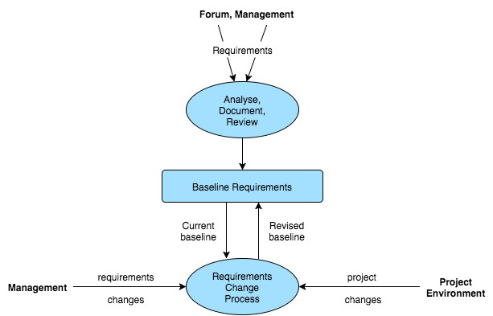

##2. BigBlueButton Requirements

##2.1. New Requirements

In the BigBlueButton community, the process of elicitation for new requirements works in a different way of the tipically used in software engineering. 
The development team canvasses suggestions for  new requirements in the forum user community. When someone from the development team finds a proposal worthwhile, they pitch a new issue in *Github*. The proposition has then to be accepted by the project manager. If this proposal entails major alterations to the project, the lead architect has to give his approval. In the event of being accepted, the new feature is added as a milestone to the next release.

Contrary to custom, the requirements are designed by the developers. While taking into consideration the users requests and suggestions, the development team is the one responsible for the discussion and documentation of how to implement, integrate the new feature and for the revision of the request. After everything has been outlined, the development phase can begin.

Below there's a schema of the boundary between the requirements development and requirements management of this project.

##2.2. Specification

<!-- Descrever os requesitos -->

The purpose of BigBlueButton is to bring access an high-quality online learning experience to every student with a web browser. There will be 3 kinds of users: 1) the *viewers*, who will usually be the students; 2) the professors or *presenters* who will be teaching; 3) the *moderators*, who will be in charge of maintaining the overall welfare of the presentation. In order to do this, certain requirements were needed for BigBlueButton to be able to achieve its purpose. 

* The *viewers* have to be able to get a clean and sleek interface, so that they can easily interact with the application. They also need means to participate in a presentation, whether if he wants to have a more laid-back, passive attitude (by giving means of just be able to listen and view the presentations, *Fig.1*) or a more active participation by providing the viewer with chat possibilities *(Fig.2)* and also to interact with the presenter and the presentation itself, by showing if the viewer is content, confused or wants to raise his hand to participate *(Fig.3)*.

  
  
        
<b>Fig. 1</b> - Initial choice for speaking or listening only

        

  
  
        
<b>Fig. 2</b> - Viewer can chat with the public, for all to see (left) or he can choose someone to private chat with (right)

        

  
  
        
<b>Fig. 3</b> - Viewer can signal various emotions, in this case, the viewer is confused with the presentation

        

* The *presenters* need to be able to easily transmit their knowledge to the viewers, whether by chat, audio and/or video messages, or even with the possibility of desktop sharing *(Fig.4)*. It is also imperative to give them the possibility to upload demonstrative files of the subject they are presenting to help contextualizing, and also to edit them in real-time, in the case they want to make some extra annotations or to emphasize some particular detail in their uploads *(Fig.5)*.

  
  
        
<b>Fig. 4</b> - As a presenter, one can enable/disable own audio and video and share his desktop with any person he sees fit

        

  
  
        
<b>Fig. 5</b> - The presenter can write anything over the slides he uploaded. He also has options to draw squares, rectangles or even free drawings

        

* The *moderators* have to be able to choose who they want the presenter to be (including themselves), and giving them their respective capabilities. They also need to be able to mute and unmute both the viewers and presenters, to avoid various situations like many users talking at the same time, or background noise from a specific user. They also need to get the possibility to lock down a user, for example, in a case where this user shows abusive behavior

  
  
        
<b>Fig. 6</b> - The moderator can make someone the new presenter (including himself)

        

  
  
        
<b>Fig. 7</b> - The moderator can mute/unmute and lock other users

        

  
  
        
<b>Fig. 8</b> - The moderator/presenter will see, at the top of the list, if any user asks for permission to intervene in the presentation. He can then unmute or turn video chat on

        

##2.3. Requirements Analysis

<!-- Tabela com os requisitos + características -->

| Name   |      Description    |
|----------|:-------------:|
| Audio |  BBB should have audio for all users with no perceptual delay between them |
| Presentation |  Full-screen mode of the presentation, which includes notifications for new chat messages or of people joining in or out  |
| Whiteboard | TODO |
| Chat |
| Desktop sharing |
| Polling |
| Breakout Rooms |
| Shared Notes |
| Video |
| Record and playback |
| Synchronized playback of external media |

##2.4. Critical Analysis

<!-- Problemas que tivemos em fazer o levantamento de requesitos, Técnicas usadas e porque que não usamos outras -->
