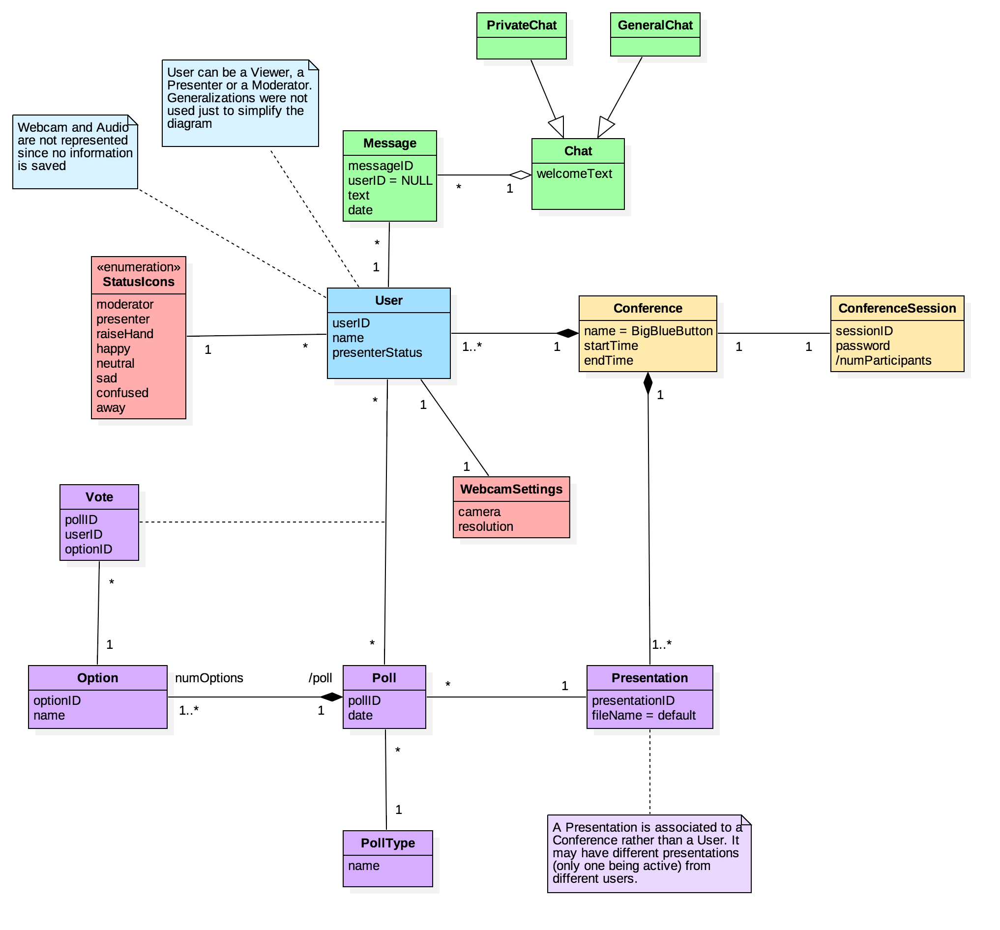

##4. Domain Model

##4.1. Description

To create a conference a user must assign a name and a password to that session, in order to allow the other users to authenticate and access the presentation. That user is the conference Moderator which can assign to someone the role of Presenter. All users have a specific status icon which represents its role, emotional or away status.

A Presenter may upload a file or use the default (whiteboard) and he has the possibility to create a poll. For this, he may choose a pre-defined type (with default options) or customize it with a limit of 6 options. When the poll starts, all Viewers receive a notification so they can vote and the Presenter may publish the results or cancel it at anytime. 

Lastly, a conference allows the users to communicate through a general or private chat platform and also use features like webcam sharing and audio.

##4.2. Constraints

| Class   |      Constraint    |
|----------|-------------|
| ConferenceSession | `ConferenceSession.allInstances->isUnique{sessionID}` |
| ConferenceSession |  `numParticipants <= 150`  |
| ConferenceSession |  `numParticipants = User.count()`  |
| Conference | `endTime > startTime` |
| Message | `Message.allInstances->isUnique{messageID}` |
| Option | `Option.allInstances->isUnique{optionID}` |
| Option | `numOptions = Poll.options.count()` |
| Poll | `Poll.allInstances->isUnique{pollID}` |
| Presentation | `Presentation.allInstances->isUnique{presentationID}` |
| User | `User.allInstances->isUnique{userID}` |
| User | `presenterStatus = true implies StatusIcons = presenter` |

  <a href="https://github.com/mariateresachaves/bigbluebutton/blob/master/ESOF-DOCS/Requirements/Index.md">Back to Index</a>

