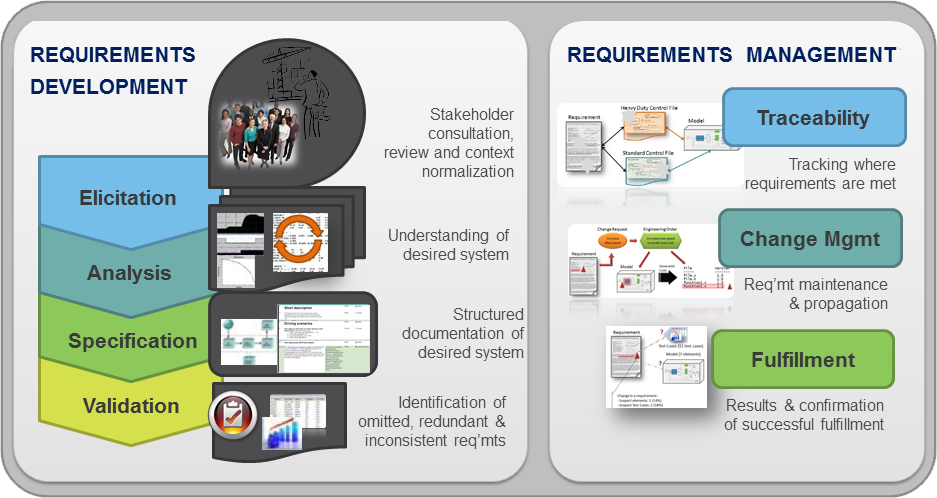

##1. Requirements Engineering

<!-- serve só para contextualizar -->

##1.1. Description

Software development begins by specifying the respective project requirements. These are statements that describe what the system must do, how it must behave, the properties it must exhibit, the qualities it must possess, and the constraints that the system and its development must satisfy. Requirements engineering emphasizes the use of systematic and repeatable techniques that ensure the completeness, consistency, and relevance of the system requirements. 

The *IEEE* defines a requirement as:    

1. a condition or capability needed by a user to solve a problem or achieve an objective,
2. a condition or capability that must be met or possessed by a system or system component to satisfy a contract, standard, specification, or other formally imposed document,
3. a documented representation of a condition or capability as in definition 1 or 2.    
*[Institute of Electrical and Electronic Engineers. IEEE Standard Glossary of Software Engineering Terminology (IEEE Std 610.12-1990). New York, NY: Institute of Electrical and Electronics Engineers, 1990.]*

Requirements engineering comprises the following:
* **Requirements elicitation:** is the process of discovering, reviewing, documenting, and understanding the user's needs and constraints for the system.
* **Requirements analysis:** is the process of refining the user's needs and constraints.
* **Requirements specification:** is the process of documenting the user's needs and constraints clearly and precisely.
* **Requirements verification:** is the process of ensuring that the system requirements are complete, correct, consistent, and clear.
* **Requirements management:** is the process of scheduling, coordinating, and documenting the requirements engineering activities (that is, elicitation, analysis, specification, and verification).

Requirements engineering is very complex because of the three roles involved in producing even a single requirement:
the **user**, the **developer** (who will design and implement the system), and the **author** (who will document the requirements). Requirements address a fundamental communications problem due to:
* The user understands the problem to be solved by the system but not how to develop a system;
* The developer understands the tools and techniques required to construct and maintain a system but not the problem to be solved by that system;
* Finally the author needs to create a statement that communicates unambiguously to the developer what the requestor desires. 
This problem ir further complicated by the number and diversity of system users. In practice, any system stakeholder has needs and expectations, i.e. requirements, for the system.  The clear definition of the requirements is of vital importance because of their pervasive quality. They continuously affect the development and maintenace phases throughout a system's development. For example, in the testing phase, the requirements provide a quality statement in wich is possible to define the standard of correctness against which to test.

------
Understanding what the client actually wants or what he believes he needs (beyond other aspects like business or process rules) is a high priority issue. However this task is far from easy. In software engineering it's never clear which are the requirements based only on the users and customers description, since they have no clue about the project's complexity and other related issues.
In order to collect/discover their requirements there are useful **techniques**

##1.2. Techniques

* Interviews - various issues are explored with stakeholders, or is based on a pre-determined list of questions or mixing both;

* Facilitated meetings (brainstorming, focus groups, etc.) - 

* Questionnaires - 

* Goal analyses - 

* Social observation and analysis (of how people actually work) - 

* (User-interface) Prototypes - 

* Scenarios, user stories, use cases (real-life usage examples) - 

<!-- quais as técnicas que existem -->

##1.3. Stakeholders

The role of system stakeholder is played by any of the various people or systems involved in or affected by a system's development. This group includes:
* **executives**: (who know the organization's business goals and constraints);
* **end users** (who know how the products will be used);
* **marketers** (who know the market demands);
* **technical managers** (who know the available personnel);
* **developers** (who know the available tools and technology). 

The success of requirements engineering depends on the identification and solicitation of the appropriate community of stakeholders. Reconciling the diverse needs and expectations of the various system stakeholders necessitates tradeoffs,this means, decisions have to be made to sort out potentially conflicting requirements from different stakeholders.

##1.4. Inappropriate requirements

The failure to capture the right requirements is the major risk with requirements engineering. If the requirements are in any way compromised they will be unable to produce systems that satisfy the customers and fulfill the market expectations. 
Inappropriate requirements can result from the following:

<--- ----Editar----- --->
* failure to distinguish between product-line-wide requirements and product-specific requirements: These different kinds of requirements have different audiences in a product line. The core asset builders need to know the requirements they must build to, while the product-specific software builders must know what is expected of them.
* insufficient generality: Insufficient generality in the requirements leads to a design that is too brittle to deal with the change actually experienced over the lifetime of the product line.
* excessive generality: Overly general requirements lead to excessive effort in producing both core assets (to provide that generality) and specific products (which must turn that generality into a specific instantiation).
* wrong variation points: Incorrect determination of the variation points results in inflexible products and the inability to respond rapidly to customer needs and market shifts.
* failure to account for qualities other than behavior: Product line requirements (and software requirements in general) should capture requirements for quality attributes such as performance, reliability, and security.

