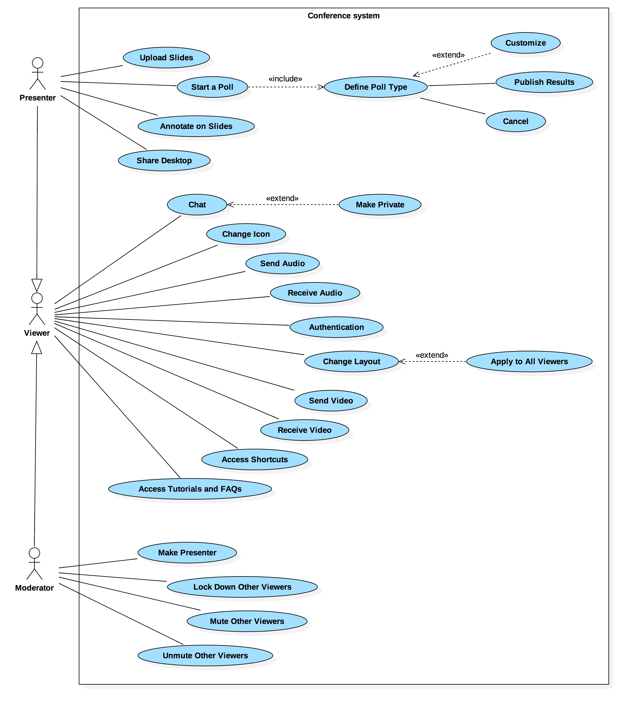

##3. Requirements Specification

##3.1. Requirements Overview

<!-- Descrever os requesitos -->

The purpose of BigBlueButton is to bring access an high-quality online learning experience to every student with a web browser. There will be 3 kinds of users: 1) the *viewers*, who will usually be the students; 2) the professors or *presenters* who will be teaching; 3) the *moderators*, who will be in charge of maintaining the overall welfare of the presentation. In order to do this, certain requirements were needed for BigBlueButton to be able to achieve its purpose. 

* The *viewers* have to be able to get a clean and sleek interface, so that they can easily interact with the application. They also need means to participate in a presentation, whether if he wants to have a more laid-back, passive attitude (by giving means of just be able to listen and view the presentations, *Fig.2*) or a more active participation by providing the viewer with chat possibilities *(Fig.3)* and also to interact with the presenter and the presentation itself, by showing if the viewer is content, confused or wants to raise his hand to participate *(Fig.4)*.

  
  
        
<b>Fig. 2</b> - Initial choice for speaking or listening only

        

  
  
        
<b>Fig. 3</b> - Viewer can chat with the public, for all to see (left) or he can choose someone to private chat with (right)

        

  
  
        
<b>Fig. 4</b> - Viewer can signal various emotions, in this case, the viewer is confused with the presentation

        

* The *presenters* need to be able to easily transmit their knowledge to the viewers, whether by chat, audio and/or video messages, or even with the possibility of desktop sharing *(Fig.5)*. It is also imperative to give them the possibility to upload demonstrative files of the subject they are presenting to help contextualizing, and also to edit them in real-time, in the case they want to make some extra annotations or to emphasize some particular detail in their uploads *(Fig.6)*. The polling option is also available, which can be useful for interactive exercises with the audience *(Fig.7)*.

  
  
        
<b>Fig. 5</b> - As a presenter, one can enable/disable own audio and video and share his desktop with any person he sees fit

        

  
  
        
<b>Fig. 6</b> - The presenter can write anything over the slides he uploaded. He also has options to draw squares, rectangles or even free drawings

        

  
  
        
<b>Fig. 7</b> - Various polls can be done, including with custom choice options

        

* The *moderators* have to be able to choose who they want the presenter to be *(Fig.8)*, and giving them their respective capabilities. They also need to be able to mute and unmute both the viewers and presenters, to avoid various situations like many users talking at the same time, or background noise from a specific user. They also need to get the possibility to lock down a user, for example, in a case where this user shows abusive behavior. *(Fig.9)* In addition, he can also see the displayed reactions of the viewers, which will always appear at the top of the users list and act upon them *(Fig.10)*.

  
  
        
<b>Fig. 8</b> - The moderator can make someone the new presenter (including himself)

        

  
  
        
<b>Fig. 9</b> - The moderator can mute/unmute and lock other users

        

  
  
        
<b>Fig. 10</b> - The moderator/presenter will see, at the top of the list, if any user asks for permission to intervene in the presentation. He can then unmute or turn video chat on

        

##3.2. Use Case Diagram

BigBlueButton is a conference system in which the users can assume different roles according to their purpose. After **authenticating** the user can access to the system as a **Viewer**, **Presenter** or a **Moderator**.

The **Viewers** have to be able to get a clean and sleek interface, so that they can easily interact with the application, without distractions. They also need means to participate in a presentation, whether if he wants to have a more laid-back, passive attitude (by giving means of just be able to listen and view the presentations, *Fig.2*) or a more active participation by providing the viewer with **video and audio**. They are provided with **chat** possibilities *(Fig.3)* and also the ability to interact with the presenter and the presentation itself, through **status icons** that relay his emotions to the presenter *(Fig.4)*. He can also **raise his hand** to participate, just like in a classroom. Lastly, he has a number of customizable settings, like **changing the layout** (and even **customize the layout** and **apply it to all**), **access webcam settings** to **change camera** and to **set image resolution** and have **access to tutorials and FAQs** to understand how the system works. .

The **Moderator** can:

* **make** a Viewer the **presenter**;
* **lock down other Viewers**, to ensure that other Viewers cannot become presenters;
* **(un)mute other Viewers**;
* **mute all except the presenter**. If a Viewer joins after the mute all option is activated, then that Viewer will be also muted;
* **lock user microphone**

The **Presenter** can:

* **upload files** and switch between files (if there's no upload the default file is a whiteboard)
* **start a poll** and choose the type. He has the possibility to **customize** it and after that he can **publish the results** or **cancel the poll** at anytime;
* **annotate on files** like a whiteboard;
* **share desktop**.

Below there's a use case diagram to represent the actions that the user can perform on the system.

<!-- Diagrama de casos de uso, o que significa cada caso de uso -->
