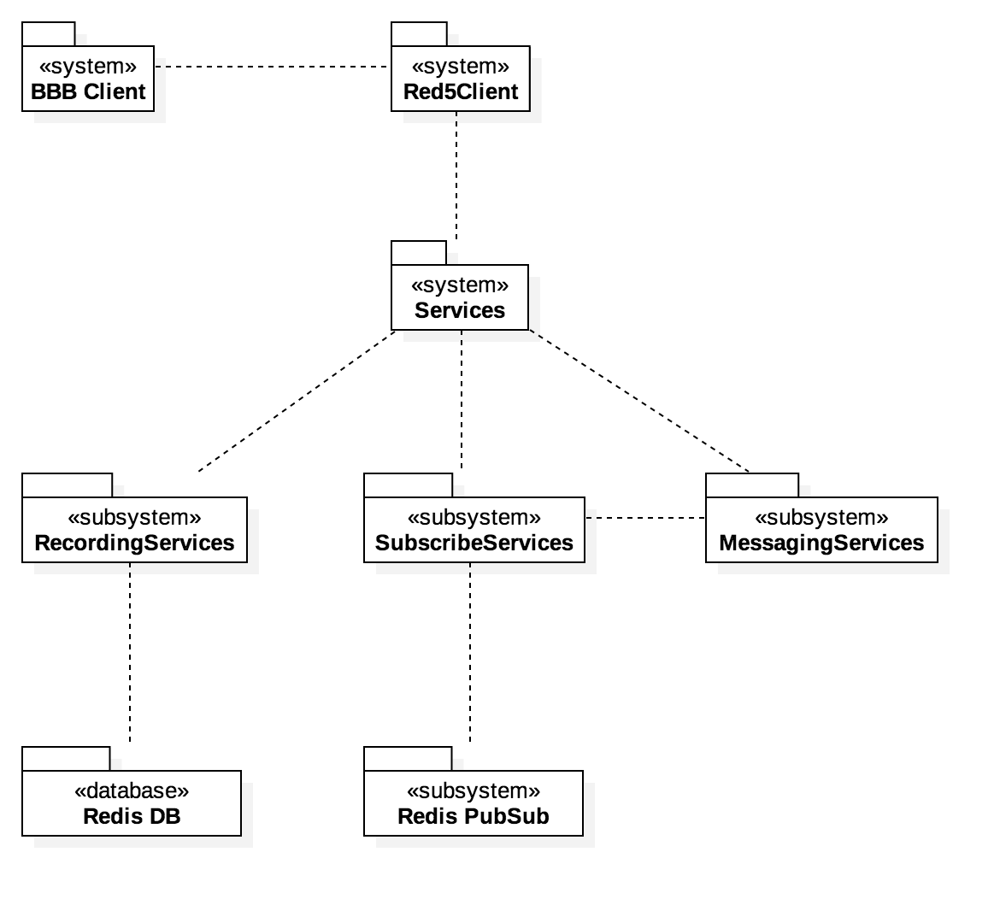
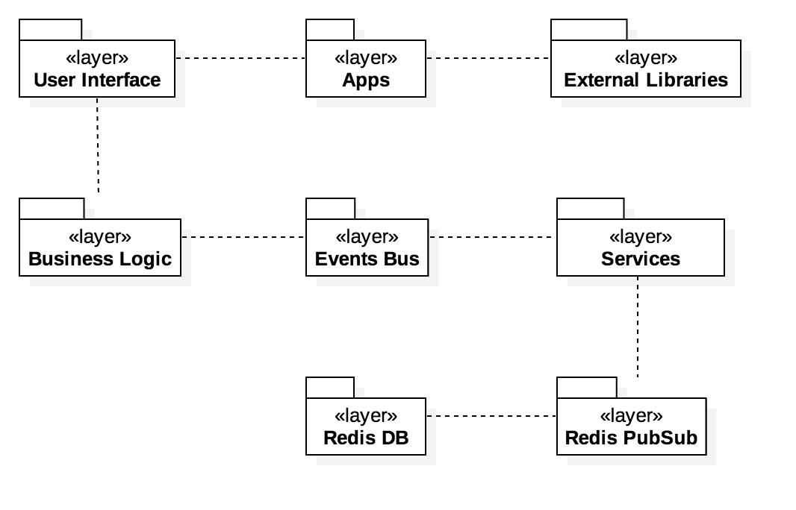
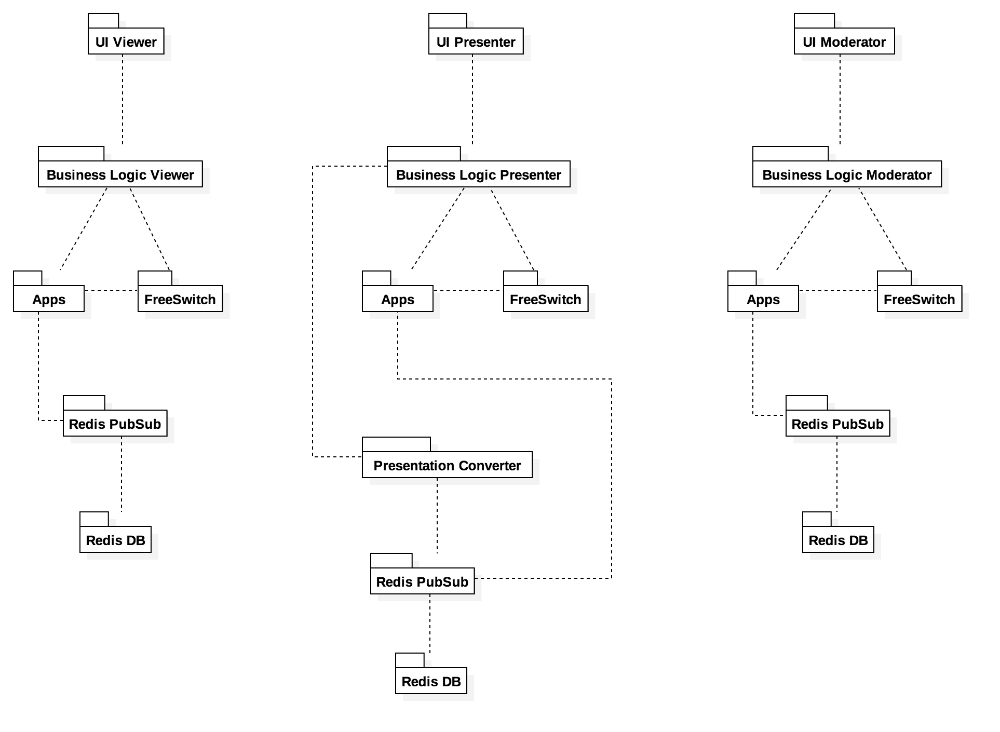

#3. Logical View
##3.1. Logical View Introduction

The **Logical View** consists in realizing an application’s functionality in terms of structural elements, key abstractions and mechanisms, separation of concerns and distribution of responsibilities. Architects use this view for functional analysis.

The main purposes of **Package Diagrams** are:
  *  organize model elements and diagrams into groups by semantically related elements
  *  illustrate the functionality of a software system
  *  represent the different layers to illustrate the layered architecture
  *  indicate the communication mechanism between layers

##3.2. UML Package Diagram

In order to understand better the BigBlueButton high level architecture (from a logical view perspective), it’s presented below three kind of package diagrams: an **horizontal decomposition**, which describes the technical layers; a **vertical decomposition**, which describes the functional subsystems and a **matricial decomposition** which mainly describes the linkage and “path” between the user interfaces (a high level perspective) till a more physical level (e.g. databases).

This project is designed in a very modular way, i.e., it relies on many third party applications and distributed services in order to display and allow the user to experience a video conferencing system (note: BBB has been under development during the last 7 years). Thus, to not turn the package diagrams extremely complex and confusing, we gathered information from the BIgBlueButton documentation (like we always did) and extracted which was **rather relevant and important**. After that research, we reached to the following **vertical decomposition** diagram.

  
  
        
<b>Fig. 9</b> Vertical Decomposition

  

In simple words, the **BBB Client** (which is a Flash application) runs inside the browser. This client connects to **Red5** using RTMP or RTMPT (with specific ports for each one of them), just like described in the previous section. This **Red5 Client** uses many **Services** which will try to fulfill the requests made by **Red5 Client**. Those services can be **Recording Services**, **Subscribe Services** or **Messaging Services**. To simplify how this works, the **Red5** has a message receiver which is entirely connected with the **Subscribe Service**, receiving messages from the **PubSub** which provides a communication channel between different server side applications. This process requires the **Messaging Service** (which takes care of receiving messages from **Red5** and send messages to it when something is finished) in order to perform its purpose. Lastly, there is the **Recording Service** which is used during the video conferencing to save records of webcam and audio feed.  
  
In addition to this, we have the **horizontal decomposition** which complements and helps to understand better how BigBlueButton actually works.

  
  
        
<b>Fig. 10</b> Horizontal Decomposition

  

The technical layers are, in some way, quite simple to understand after the **vertical decomposition**. First we have the **User Interface** like any other application. This is comprised of **Apps** and they interact with **External Libraries** to get the necessary resources, in order to display the **User Interface** (note again that BBB uses many external libraries and different apps, and thus we decided to incorporate them in a package each to simplify this diagram). When some event is called, the interface goes through the **Business Logic** to the **Events Bus** (which is a way to establish the bond between the interface and the Red5 client). This **Events Bus** obviously requires **Services** which again will “ask” the **Redis PubSub** to provide a communication between the different server side applications. After this process, it reaches to the most physical level which is the **Redis DB** (which includes many methods associated with it, rather than just being a simple database), where the records are stored and managed.  
  
To finish the logical view we have the **matricial decomposition**.

  
  
        
<b>Fig. 11</b> Matricial Decomposition

  

We’ve separated this diagram into 3 different “views” due to its differences and to make it easier to understand. The left side (starting in **UI Viewer**) goes though the **Business Logic** (concerning this type of user) establishes connection with the various **Apps** which BlueBlueButton connects with to display its features. In this diagram there’s something different than the others - the **FreeSwitch** which provides the voice conferencing capability in BBB and we considered this set of related methods as a package, based on the research we made (BigBlueButton’s documentation). Beyond these reasons, we’ve taken into consideration that this module takes part in all audio communications  and connections with **Apps**, and thus can’t be ignored. The rest of the diagram (**Redis PubSub** and **Redis DB**) is quite similar to the others but it’s also presented just to make all the process clear to the reader. The right side of the diagram (starting in **UI Moderator**) is the same since every feature that these users can do, uses the same packages in spite of being very distinct users (this happens mainly because the Moderator is not supposed to be on the “center” of the application). The center  of the diagram (starting in **UI Presenter**) works in a slightly different way, especially concerning the uploading of presentations. After going through the **Business Logic**, when a file is uploaded it has to be converted to display it on the Flash Client - the package which takes care of this process is called **Presentation Converter**. For example, if the uploaded file is an Office document, it gets converted into PDF using LibreOffice and then converted to SWF using SWFTools. After this conversion, it goes down to the **Redis PubSub** and after that it is transmitted to the **Apps** again, till it reaches the **User Interface** again.
  
&nbsp;

  <a href="https://github.com/mariateresachaves/bigbluebutton/blob/master/ESOF-DOCS/Software_Architecture/BigBlueButton.md"><< BigBlueButton Architecture</a>
  &nbsp;&nbsp;&nbsp;&nbsp;&nbsp;&nbsp;&nbsp;&nbsp;&nbsp;&nbsp;&nbsp;&nbsp;&nbsp;&nbsp;&nbsp;&nbsp;&nbsp;&nbsp;&nbsp;&nbsp;&nbsp;&nbsp;&nbsp;&nbsp;&nbsp;&nbsp;&nbsp;&nbsp;
  <a href="https://github.com/mariateresachaves/bigbluebutton/blob/master/ESOF-DOCS/Software_Architecture/Index.md">Index</a>
  &nbsp;&nbsp;&nbsp;&nbsp;&nbsp;&nbsp;&nbsp;&nbsp;&nbsp;&nbsp;&nbsp;&nbsp;&nbsp;&nbsp;&nbsp;&nbsp;&nbsp;&nbsp;&nbsp;&nbsp;&nbsp;&nbsp;&nbsp;&nbsp;&nbsp;&nbsp;&nbsp;&nbsp;
  <a href="https://github.com/mariateresachaves/bigbluebutton/blob/master/ESOF-DOCS/Software_Architecture/Implementation%20View.md#4-implementation_view">Implementation View >></a>

