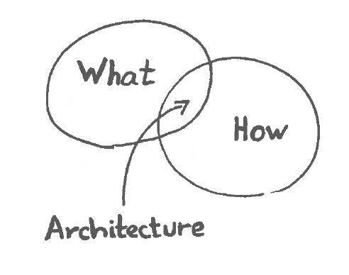

#1. Software Architecture 

##1.1. Description

<!--As an house needs an architect, an important step on software development is making the software architecture. It is the process of building a structured software solution in order to understand how the system will behave. The main goal of this solution is to meet the technical and operational requirements.-->

  
  
        
<b>Fig. 1</b> Software Architecture

        

The *IEEE* defines software architecture as:
  * The fundamental organization of a system, embodied in its components, their relationships to each other and the environment, and the principles governing its design and evolution.

  <a href="https://github.com/mariateresachaves/bigbluebutton/blob/master/ESOF-DOCS/Requirements/Requirements%20Engineering.md"><< Requirements</a>
  &nbsp;&nbsp;&nbsp;&nbsp;&nbsp;&nbsp;&nbsp;&nbsp;&nbsp;&nbsp;&nbsp;&nbsp;&nbsp;&nbsp;&nbsp;&nbsp;&nbsp;&nbsp;&nbsp;&nbsp;&nbsp;&nbsp;&nbsp;&nbsp;&nbsp;&nbsp;&nbsp;&nbsp;
  <a href="https://github.com/mariateresachaves/bigbluebutton/blob/master/ESOF-DOCS/Software_Architecture/Index.md">Index</a>
  &nbsp;&nbsp;&nbsp;&nbsp;&nbsp;&nbsp;&nbsp;&nbsp;&nbsp;&nbsp;&nbsp;&nbsp;&nbsp;&nbsp;&nbsp;&nbsp;&nbsp;&nbsp;&nbsp;&nbsp;&nbsp;&nbsp;&nbsp;&nbsp;&nbsp;&nbsp;&nbsp;&nbsp;
  <a href="https://github.com/mariateresachaves/bigbluebutton/blob/master/ESOF-DOCS/Software_Architecture/BigBlueButton.md">BigBlueButton Architecture >></a>

