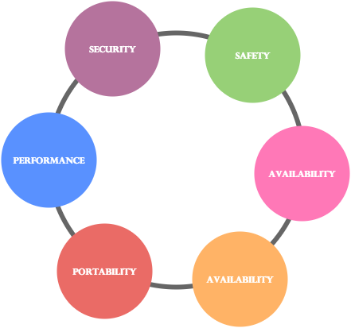
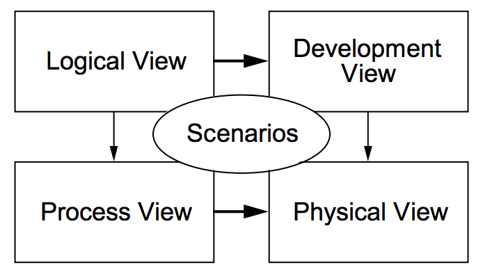

#1. Software Architecture 

##1.1. Overview

Software architecture is the process of building a structured solution of **what** features are needed and **how** the system must behave (*Fig.1*). In order to do that, usually there is a software architect which leads a team of developers and engineers, making sure all the pieces come together to make fully functioning software.

  
  
        
<b>Fig. 1</b> Software Architecture

        

 

<table border="2px">
  <td>A classic definition for <strong>Software Architecture</strong> according to <i>IEEE</i> is:  
  &nbsp;&nbsp;&nbsp;&nbsp;&nbsp;&nbsp;&nbsp;&nbsp;&nbsp;&nbsp;&nbsp;&nbsp;" Software Architecture is the fundamental organization of a <strong>system</strong>, embodied in its <strong>components</strong>, their <strong>relationships</strong> to each other and the <strong>environment</strong>, and the principles governing its design and evolution. "</td>
</table>

 

In other words, the architecture will include how the system is separated in modules/packages, the way how they will interact with each other and everything the system interacts with, in order to be achieved the desired structured architecture. If this is fulfilled it's easier to change it when new requirements come up, unlike other architectures which are constantly in change due to design errors. To minimize the probability of falling into this error there are aspects as performance, security, safety, availability, maintainability and portability (*Fig.2*) to ensure that the software system is well structured.

  
  
        
<b>Fig. 2</b> Software Architecture aspects

        

##1.2. 4+1 View Model

This model allow the various stakeholders to find what they want to know about the software architecture. Systems engineers approach it from the Physical view, then the Process view. End-users, customers, data specialists from the Logical view. Project managers, software configuration staff see it from the Development view.

  
  
        
<b>Fig. 2</b> Software Architecture aspects

        

###1.2.1. Logical View

###1.2.2. Implementation View

###1.2.3. Deployment View

###1.2.4. Process View

<!-- FOOTER -->

  <a href="https://github.com/mariateresachaves/bigbluebutton/blob/master/ESOF-DOCS/Requirements/Requirements%20Engineering.md"><< Requirements</a>
  &nbsp;&nbsp;&nbsp;&nbsp;&nbsp;&nbsp;&nbsp;&nbsp;&nbsp;&nbsp;&nbsp;&nbsp;&nbsp;&nbsp;&nbsp;&nbsp;&nbsp;&nbsp;&nbsp;&nbsp;&nbsp;&nbsp;&nbsp;&nbsp;&nbsp;&nbsp;&nbsp;&nbsp;
  <a href="https://github.com/mariateresachaves/bigbluebutton/blob/master/ESOF-DOCS/Software_Architecture/Index.md">Index</a>
  &nbsp;&nbsp;&nbsp;&nbsp;&nbsp;&nbsp;&nbsp;&nbsp;&nbsp;&nbsp;&nbsp;&nbsp;&nbsp;&nbsp;&nbsp;&nbsp;&nbsp;&nbsp;&nbsp;&nbsp;&nbsp;&nbsp;&nbsp;&nbsp;&nbsp;&nbsp;&nbsp;&nbsp;
  <a href="https://github.com/mariateresachaves/bigbluebutton/blob/master/ESOF-DOCS/Software_Architecture/BigBlueButton.md">BigBlueButton Architecture >></a>

