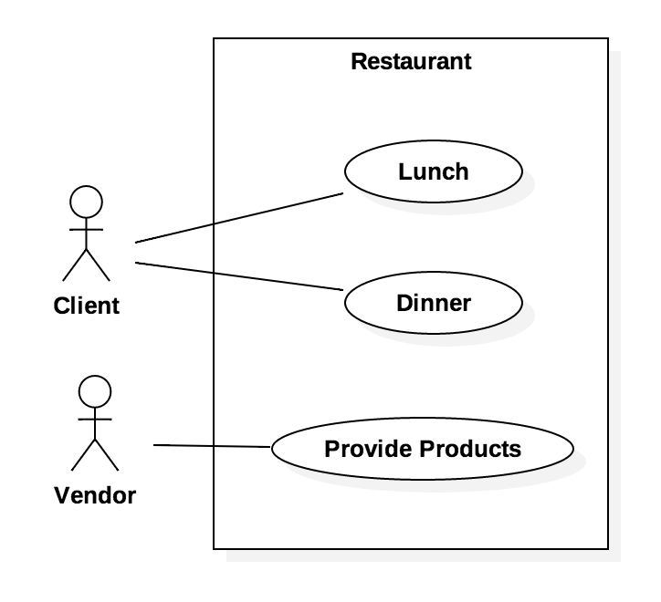

#1. Software Architecture 

##1.1. Overview

Software architecture is the process of building a structured solution of **what** features are needed and **how** the system must behave (*Fig.1*). In order to do that, usually there is a software architect which leads a team of developers and engineers, making sure all the pieces come together to make fully functioning software.

  
  
        
<b>Fig. 1</b> Software Architecture

  

 

<table border="2px">
  <td>A classic definition for <strong>Software Architecture</strong> according to <i>IEEE</i> is:  
  &nbsp;&nbsp;&nbsp;&nbsp;&nbsp;&nbsp;&nbsp;&nbsp;&nbsp;&nbsp;&nbsp;&nbsp;" Software Architecture is the fundamental organization of a <strong>system</strong>, embodied in its <strong>components</strong>, their <strong>relationships</strong> to each other and the <strong>environment</strong>, and the principles governing its design and evolution. "</td>
</table>

 

In other words, the architecture will include how the system is separated in modules/packages, the way how they will interact with each other and everything the system interacts with, in order to be achieved the desired structured architecture. If this is fulfilled it's easier to change it when new requirements come up, unlike other architectures which are constantly in change due to design errors. To minimize the probability of falling into this error there are aspects as performance, security, safety, availability, maintainability and portability (*Fig.2*) to ensure that the software system is well structured.

  
  
        
<b>Fig. 2</b> Software Architecture aspects

  

##1.2. 4 + 1 View Model

This model allows the various [Stakeholders](https://github.com/mariateresachaves/bigbluebutton/blob/master/ESOF-DOCS/Requirements/Requirements%20Engineering.md#13-stakeholders) to find what they want to know about the software architecture. Systems engineers approach it from the Physical View, then the Process View. End-users, customers, data specialists from the Logical View. Project managers, software configuration staff see it from the Development View.

  
  
        
<b>Fig. 3</b> 4+1 View Model

  

As shown in the previous image (*Fig.3*), this model is composed by Logical View, Implementation View, Deployment View, Process View and Use Case View. Below there's a brief definition for each one of the Views:  
  * **Logical View** - shows the key abstractions in the system as objects or object classes, or their packages;

  

    
    
          
<b>Fig. 4</b> Example of Logical View (UML package diagram)

    
  

  * **Implementation View** - shows how the software is decomposed (into software components) for development;
   
  

    
    
          
<b>Fig. 5</b> Example of Implementation View (UML component diagram)

    
  

  * **Deployment View** - shows the system hardware and how software components are distributed across the hardware nodes;

  

    
    
          
<b>Fig. 6</b> Example of Deployment View (UML deployment diagram)

    
  

  * **Process View** - shows how, at run-time, the system is composed of interacting processes;

  

    
    
          
<b>Fig. 7</b> Example of Process View (UML activity diagram)

    
  

  * **Use Case View (+1)** - Relates the other views.

  

    
    
          
<b>Fig. 8</b> Example of Use Case View (use case diagram)

    
  

##1.3 Architectural Patterns

###1.3.1 Model-view-controller

The Model-View-Controller (MVC) pattern main purpose is to separate the modeling of the domain, the presentation, and the actions based on user input into three separate logical parts, in which all interact with each other. This pattern helps keeping a clean separation of roles, is easy to maintain as well as making it ideal for parallel programming. The main disadvantage of this pattern, is that it's too complex for a smaller scale project, where the effects might be adverse.

    
    
          
<b>Fig. 9</b> Model-View-Controller pattern

    

###1.3.2 Pipes and filters

The Pipes and Filters pattern consists of a chain of processes or other data processing entities, organized in such a way that the output of one element of this chain will be the input of the next element. This pattern is best known for it's improved modifiability. A Pipes and Filters solution can easily replace a filter with another filter with different resource requirements. However, this pattern can be of increased complexity, requiring expert domain knowledge. Lowered performance due to communication overhead is another of the problems of this pattern.

    
    
          
<b>Fig. 10</b> Pipes and Filters pattern

    

###1.3.3 Layered architecture 

###1.3.4 Repositories

###1.3.5 Client-server

<!-- FOOTER -->

  <a href="https://github.com/mariateresachaves/bigbluebutton/blob/master/ESOF-DOCS/Requirements/Requirements%20Engineering.md"><< Requirements</a>
  &nbsp;&nbsp;&nbsp;&nbsp;&nbsp;&nbsp;&nbsp;&nbsp;&nbsp;&nbsp;&nbsp;&nbsp;&nbsp;&nbsp;&nbsp;&nbsp;&nbsp;&nbsp;&nbsp;&nbsp;&nbsp;&nbsp;&nbsp;&nbsp;&nbsp;&nbsp;&nbsp;&nbsp;
  <a href="https://github.com/mariateresachaves/bigbluebutton/blob/master/ESOF-DOCS/Software_Architecture/Index.md">Index</a>
  &nbsp;&nbsp;&nbsp;&nbsp;&nbsp;&nbsp;&nbsp;&nbsp;&nbsp;&nbsp;&nbsp;&nbsp;&nbsp;&nbsp;&nbsp;&nbsp;&nbsp;&nbsp;&nbsp;&nbsp;&nbsp;&nbsp;&nbsp;&nbsp;&nbsp;&nbsp;&nbsp;&nbsp;
  <a href="https://github.com/mariateresachaves/bigbluebutton/blob/master/ESOF-DOCS/Software_Architecture/BigBlueButton.md">BigBlueButton Architecture >></a>

