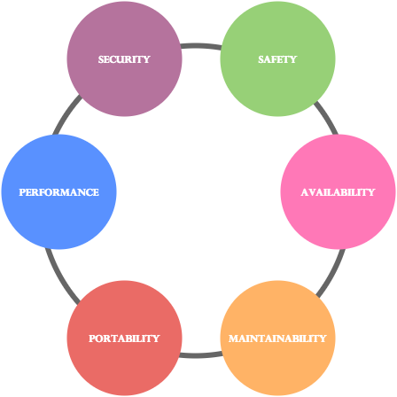

#1. Software Architecture 

##1.1. Description

As an house needs an architect, an important software development step is the software architecture. It is the process of building a structured solution of **what** are the features needed on the software and **how** the system will behave (*Fig.1*). Aspects as performance, reliability, scalability, testbility, maintainability and others are the main focus of this phase (*Fig.2*).

  
  
        
<b>Fig. 1</b> Software Architecture

        

  
  
        
<b>Fig. 2</b> Software Architecture aspects

        

The *IEEE* defines **Software Architecture** as:
  * " The fundamental organization of a **system**, embodied in its **components**, their **relationships** to each other and the **environment**, and the principles governing its design and evolution. "

  <a href="https://github.com/mariateresachaves/bigbluebutton/blob/master/ESOF-DOCS/Requirements/Requirements%20Engineering.md"><< Requirements</a>
  &nbsp;&nbsp;&nbsp;&nbsp;&nbsp;&nbsp;&nbsp;&nbsp;&nbsp;&nbsp;&nbsp;&nbsp;&nbsp;&nbsp;&nbsp;&nbsp;&nbsp;&nbsp;&nbsp;&nbsp;&nbsp;&nbsp;&nbsp;&nbsp;&nbsp;&nbsp;&nbsp;&nbsp;
  <a href="https://github.com/mariateresachaves/bigbluebutton/blob/master/ESOF-DOCS/Software_Architecture/Index.md">Index</a>
  &nbsp;&nbsp;&nbsp;&nbsp;&nbsp;&nbsp;&nbsp;&nbsp;&nbsp;&nbsp;&nbsp;&nbsp;&nbsp;&nbsp;&nbsp;&nbsp;&nbsp;&nbsp;&nbsp;&nbsp;&nbsp;&nbsp;&nbsp;&nbsp;&nbsp;&nbsp;&nbsp;&nbsp;
  <a href="https://github.com/mariateresachaves/bigbluebutton/blob/master/ESOF-DOCS/Software_Architecture/BigBlueButton.md">BigBlueButton Architecture >></a>

