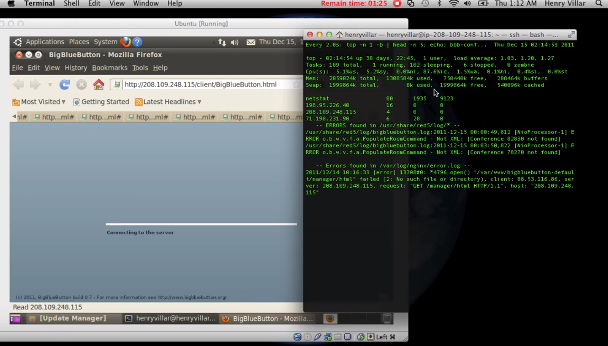

#15. Degree of Testability

##15.1. BigBlueButton Testability

In order to ensure that a program works as expected the developers implement and use tests. BigBlueButton has a specific way to guarantee the implemented features produce the expected output. This includes **Unit Testing**, **Integration Testing** and **Stress Testing**. 

###15.1.1. Testing the Gem

To test the gem BBB makes **Unit Tests** using **rspec** which are found in the folder spec/. A tester doesn't need a real BigBlueButton server to run these tests. They all use mocks and stubs to simulate the behaviour of a real server. BBB also makes **Integration Tests** using **cucumber** (and **rspec**) which are found under the folder features/. In this case the tester needs a real server to run them. This server also needs support to the Android mobile client.

To run the tests the tester uses the following commands (Ruby):
```ruby
$ bundle exec rake spec      # runs all unit tests
$ bundle exec rake cucumber  # runs all integration tests
$ bundle exec rake           # runs everything
```

###15.1.2. Testing the Mobile Client

The <a href="http://cdot.senecacollege.ca/">**Seneca CDOT**</a> of Seneca College, like many other instituitions and organizations, collaborates with open source community, business, and other instituitions. Currently, they take part of the BBBs core developement team and as a contribution they tested the Mobile Client using **Unit Tests**.  

The list of steps is shown below:  

  * **First**, it is needed to code a listener method that verifies the values that the signal is dispatched. The verification can be done simply with <code>assertThat(...)</code>. Then a 'verification' method must be added as a listener to the signal that we want to check.  
  
  * **Second**, the tester must dispatch a custom event in this verification method, that will be used in the next step.  
  
  * **Third**, in the test case, it is used <code>Async.proceedOnEvent(...)</code> to listen for the custom event that is dispatched from the verification method. The <code>Async.proceedOnEvent(...)</code> will cause the unit test to fail if the event that is being listened for does not get dispatched.  
  
  * If the signal does not get dispatched, then the verification method will never get called, and will never dispatch the event that the <code>Async</code> is waiting for, causing the unit test to fail.  
  
  * If the signal is dispatched, but with the wrong values, it will cause the <code>assertThat(...)</code> checks to fail. Any further checks on the class should also be done here, because signal are dispatched asynchronously.

The **Mobile Client** was initially structured using the **Model-View-Controller (MVC)** design pattern. As time went on the code base got scattered in a way that is not entirely in keeping with the design pattern. The **Mobile Client's** code is divided into four main parts: models, views, core, and commands. The meanings of "model" and "view" are the same as in the **MVC** design pattern.

These tests are still being implemented and no conclusions can be done at this moment.

###15.1.3. Testing the server

To test the server, BigBlueButton permitted an unexpected number of simultaneous clients in a single session. They could not only test the number of simultaneous users, but also the number of simultaneous users with good quality audio and the number of simultaneous users with webcams.

A demonstration of this kind of test is available in the following video.  

<p align="center">
 <a href="https://www.youtube.com/watch?v=Av8a0gB-Y3I"></a>
 <span class="caption">
  <p align="center"><b>Fig. 6</b> Video of stress testing on Ubuntu</p>
 </span>
</p>

##15.2. How "testable" is BigBlueButton

Based on the research made on the github repository and subsequent folders, forums and BBBs documentation we arrived to the following conclusions:

 * BigBlueButton is **testable on certain modules**, however these tests are not so different from each other (i.e. they are mostly based on unit testing), thus not ensuring other situations which can cause malfunction   
 
 * Some folders are empty or not even exist, thus concluding that **some tests are not yet implemented**  

 * To test how the system behaves with an unexpected number of users the developers make a **stress test**, which is an important issue in a web conferencing system    
  * **Controllable**, since it's possible to check the number of active users
  * **Observable**, since it's shown the information about the system load in the command line  
  * **Isolable**, since it has no dependency of other modules  
  * **Separated**, since the goal is just to send requests to the server  
  * **Understandable**, since it's documented and easy to understand
  * **Heterogeneous**, since it works in different technologies
 
 * Although they use one **integration test** it is not enough, since there's no feedback about how the components will interact with each other when they are all together  
  * **Controllable**, since the platform is designed in certain modules and layers, and therefore the current component state is controlled  
  * **Observable**, since the process is shown on the command line  
  * **Isolable**, however it depends on the module which is being tested  
  * **Separated**, since it's divided in different modules each one with the specific end  
  * **Not understandable**, since it's quite confusing to understand in spite of being documented
  * **Heterogeneous**, since it works in different technologies
 
 * Concerning the chat messages, if their format eventually changes the **unit tests** will have to be redesigned or else they will fail, so this module is not that testable as it should be    
  * **Controllable**, since the message can be traced and its content is controlled
  * **Observable**, since the message content can be shown  
  * **Isolable**, since the chat has no dependency of other modules  
  * **Separated**, since the goal is to send a message from an user to another user  
  * **Understandable**, since it's documented and easy to understand
  * **Heterogeneous**, since it works in different technologies

 * There are no **system tests**, which brings limitations concerning different environments  

 * Another important issue is that there are no **regression testing**, so there is no clue if other modules were affected by the modifications that were made  

 * Since there is no feedback from customers (except from inquiries), the developers don't mind implementing the **acceptance tests**

##15.3. How to improve BigBlueButton testability

To improve BigBlueButton's testability we suggest:

 * **System Testing** - To ensure the platform works nicely in different environments and to improve the user's perspective and experience when using BBB  

 * **Regression Testing** - To ensure there is no affected modules, when a new feature is being developed there should be intermediate testing (e.g. when changing the chat messages format, there should be a test to verify if there's no problem selecting private chat users)  

 * **Acceptance Testing** - Despite taking into consideration the customers opinion obtained from inquiries to develop new features, there are no acceptance tests which ensure that the specified feature is working as expected  

 * **Usability Testing** - To improve the user experience (chat messaging, video feed, presentation tools, etc.) there should be usability tests, while taking into consideration other users opinions and suggestions  

 * **Performance Testing** - To obtain better results concerning the system overload, file uploading, audio quality, etc. it would be reasonable to implement performance tests to identify potential memory and time consuming features


<!-- FOOTER -->

<p align=center>
  <a href="https://github.com/mariateresachaves/bigbluebutton/blob/master/ESOF-DOCS/Software_Testing/Software_Testing.md#14-software-testing"><< Software Testing</a>
  &nbsp;&nbsp;&nbsp;&nbsp;&nbsp;&nbsp;&nbsp;&nbsp;&nbsp;&nbsp;&nbsp;&nbsp;&nbsp;&nbsp;&nbsp;&nbsp;&nbsp;&nbsp;&nbsp;&nbsp;&nbsp;&nbsp;&nbsp;&nbsp;&nbsp;&nbsp;&nbsp;&nbsp;
  <a href="https://github.com/mariateresachaves/bigbluebutton/blob/master/ESOF-DOCS/Software_Testing/Index.md">Index</a>
  &nbsp;&nbsp;&nbsp;&nbsp;&nbsp;&nbsp;&nbsp;&nbsp;&nbsp;&nbsp;&nbsp;&nbsp;&nbsp;&nbsp;&nbsp;&nbsp;&nbsp;&nbsp;&nbsp;&nbsp;&nbsp;&nbsp;&nbsp;&nbsp;&nbsp;&nbsp;&nbsp;&nbsp;
  <a href="https://github.com/mariateresachaves/bigbluebutton/blob/master/ESOF-DOCS/Software_Testing/Test_Statistics_Analysis.md#16-test-statistics-analysis"> Test Statistics Analysis >></a>
</p>
