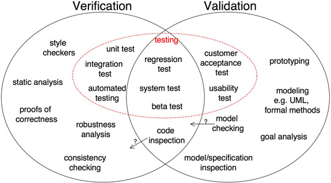

#14. Software Testing

##14.1 Overview
Software testing is any activity aimed at evaluating an attribute or capability of a program or system and determining that it meets its required results [*Hetzel, William C., The Complete Guide to Software Testing*]. Although crucial to software quality and widely deployed by programmers and testers, software testing still remains an art, due to limited understanding of the principles of software. The difficulty in software testing stems from the complexity of software: we can not completely test a program with moderate complexity. Testing is more than just debugging. The purpose of testing can be quality assurance, verification and validation, or reliability estimation. Testing can be used as a generic metric as well. Correctness testing and reliability testing are two major areas of testing. Software testing is a trade-off between budget, time and quality.

##14.2 Testing methods

**Black-Box Testing**

-	Internal structure is not known
-	Performed by end-users (clientes) and also by testers and developers
-	Testing is based on what the end-users expected
-	It’s exhaustive
- Least time-consuming method
-	Not suited for algorithm testing
- Trial and error method

**Grey-Box Testing**

-	Limited knowledge of the internal structure
-	Performed by end-users (clients) and also by testers and developers
-	Testing is done on the basis of high-level database diagrams and data flow diagrams
-	Consume a bit of time and it’s exhaustive
- Not suited for algorithm testing
-	Data domains (e.g. data types) and internal boundaries (e.g. limit of 50 users per conference) can be tested if known

**White-Box Testing**

-	Has full knowledge of the internal structure
-	Usually done by testers and developers
-	The tester can design test data accordingly
-	Exhaustive and time-consuming
- Suited for algorithm testing
-	Data domains and internal boundaries can be better tested

##14.3 Types of Testing
There are many testing methods and testing techniques, serving multiple purposes in different life cycle phases. Classified by **purpose**, software testing can be divided into:
* correctness testing; 
* performance testing; 
* reliability testing.
* security testing.    

Classified by **life-cycle phase**, software testing can be classified into the following categories: 
* requirements phase testing;
* design phase testing;
* program phase testing;
* evaluating test results;
* installation phase testing;
* acceptance testing;
* maintenance testing.    

By **scope**, software testing can be categorized as follows:
* unit testing;
* component testing;
* integration testing;
* system testing.

###14.3.1 The Most Used Types of Testing

-	**Unit testing**
	- Testing of an individual unit or group of related units
	- Falls under the class of white-box testing 
	- Often done to test if the given input is producing the expected output

-	**Integration testing**
	- Testing in which a group of components are combined to produce output
	- The interaction between hardware and software is tested in integration testing if software and hardware components have any relation
	- It may fall under both white-box and black-box testing 

-	**Functional testing**
	- Testing to ensure that the specified functionality required works
	- Falls under the class of black-box testing

-	**System testing**
	- Testing to ensure that by putting the software in different environments it still works
	- Falls under the class of black-box testing

-	**Stress testing**
	- Testing to evaluate how system behaves under unfavorable conditions
	- Conducted at beyond limits of the specifications
	- Falls under the class of black-box testing

-	**Performance testing**
	- Testing to assess the speed and effectiveness of the system
	- Falls under the class of black-box testing

-	**Usability testing**
	- Testing is performed to the perspective of the client, to evaluate how the GUI is user friendly, how easily can the client learn, etc.
	- Falls under the class of black-box testing

-	**Acceptance testing**
	- Testing is often done by the customer to ensure that the delivered product meets the requirements and works as the customer expected
	- Falls under the class of black-box testing

-	**Regression testing**
	- Testing after modification of a system, components, or a group of related units to ensure that the modification is working correctly and is not damaging or imposing other modules to produce unexpected results
	- Falls under the class of black-box testing

-	**Beta testing**
	- Testing which is done by end-users, at team outside development, or publicly releasing full pre-version of the product which is known as beta version. 
	- Falls under the class of black-box testing

##14.4 Validation vs. Verification
The terms Verification and Validation are commonly used in software engineering to mean two different types of analysis. The usual questions associated whith each one are:
* **Validation:** Are we building the right system?
* **Verification:** Are we building the system right?

**Verificaton** is **defined** as the process of evaluating work-products (not the actual final product) of a development phase to determine whether they meet the specified requirements for that phase. Its **aim** is to ensure that the product is being built according to the requirements and design specifications. In other words, to ensure that work products meet their specified requirements. The **evaluation items** are: Plans, Requirement Specs, Design Specs, Code and Test Cases. The **activities** consist of reviews, walkthroughs and inspections.
**Validation** is the process of evaluating software during or at the end of the development process to determine whether it satisfies specified business requirements. Its **aim** is to ensure that the product actually meets the user’s needs, and that the specifications were correct in the first place. In other words, to demonstrate that the product fulfills its intended use when placed in its intended environment. The **evalution item** is the actual product/software. The actitvity consists only in testing.

  
  
        
<b>Fig. 1</b> Software Testing

  

<!-- FOOTER -->

  <a href="https://github.com/mariateresachaves/bigbluebutton/blob/master/ESOF-DOCS/Software_Architecture/Software%20Architecture.md#1-software-architecture"><< Software Architecture</a>
  &nbsp;&nbsp;&nbsp;&nbsp;&nbsp;&nbsp;&nbsp;&nbsp;&nbsp;&nbsp;&nbsp;&nbsp;&nbsp;&nbsp;&nbsp;&nbsp;&nbsp;&nbsp;&nbsp;&nbsp;&nbsp;&nbsp;&nbsp;&nbsp;&nbsp;&nbsp;&nbsp;&nbsp;
  <a href="https://github.com/mariateresachaves/bigbluebutton/blob/master/ESOF-DOCS/Software_Testing/Index.md">Index</a>
  &nbsp;&nbsp;&nbsp;&nbsp;&nbsp;&nbsp;&nbsp;&nbsp;&nbsp;&nbsp;&nbsp;&nbsp;&nbsp;&nbsp;&nbsp;&nbsp;&nbsp;&nbsp;&nbsp;&nbsp;&nbsp;&nbsp;&nbsp;&nbsp;&nbsp;&nbsp;&nbsp;&nbsp;
  <a href="https://github.com/mariateresachaves/bigbluebutton/blob/master/ESOF-DOCS/Software_Architecture/BigBlueButton.md">FALTA POR >></a>

