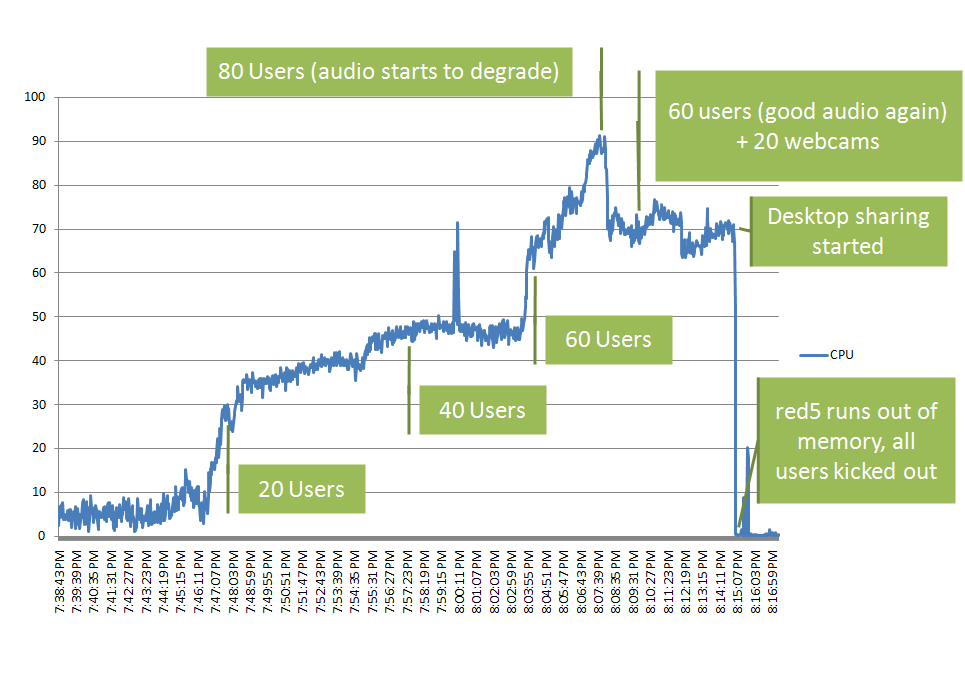
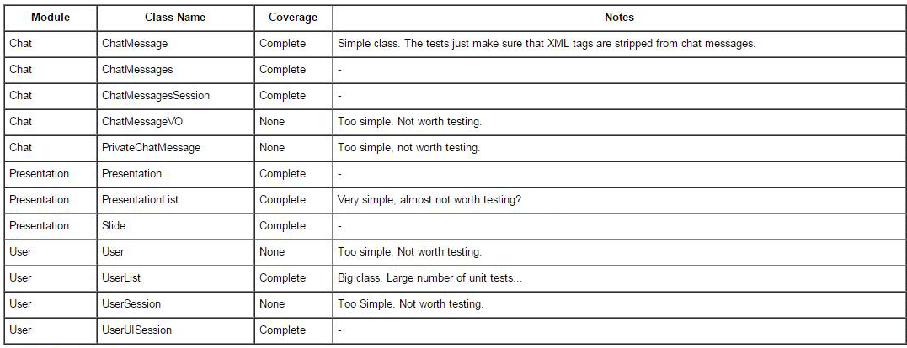

#16. Test Statistics Analysis

##16.1. Testing Results

BigBlueButton's testing phase is extensive, and one of the core development parts of the project. The developers of BigBlueButton focus their testing on 3 groups: **unit testing**, **integration testing** and **stress testing**.

The main focus of BigBlueButton's development team are the **stress tests**, which consists in having an increasingly large number of users logging in the application and using it to see what is the server response to it. Since BigBlueButton consists of a web-conferencing platform, many users will be logged in at the same time in the same room, using all the capabilities of the software simultaneously and it's imperative that the software can handle these situations.  One of these tests results is shown in Fig.2, a graph showing the CPU usage along the time.

  
  
        
<b>Fig. 2</b> Results of an audio stress test

  

In this test, the server was getting more and more users using the audio capabilities of the application, until it got overloaded when it reached about 80 users, moment where the audio started degrading, with CPU reaching 90% of it's processing power. The number of users then dropped to 60, and the audio quality was good, once again. Some users were then asked to turn on their webcams, but the CPU got very little additional load, maintaining the audio with a good quality. Users were then asked to use desktop sharing, which caused a crash of the application, thus creating another issue open for investigation.

Other focus in the testing phase is the **unit testing**. Contrary to the spirit of test driven development, the unit tests are being written **after** the core application. The developer team adds unit tests to the core modules (voice, video, chat, presentation, and desktop sharing) to verify their functionality, and follow these guidelines:

* Don't test languages or frameworks. If a developer is using a library or framework and the documentation tells the behavior of that class or function, then it shouldn't be tested, as it is a bug in that library and not in the application;
* Don't test simple "getters" and "setters" functions;
* Each control structure adds one more unit test to the function;
* Each special case deserves a unit test. Generally, each way a function can possibly be ended, adds one more unit test to that function;
* Each event that gets dispatched adds one more unit test.

In Fig. 3, we can see a table showing some of the already tested modules in BigBlueButton.

  
  
        
<b>Fig. 3</b> Different components tested

  

Lastly, in the **integration tests** developers should have a complete test suite to verify stability and conformance to documentation. Unfortunately, we didn't find any results concerning integration tests, other than what is shown in <a href="https://github.com/mariateresachaves/bigbluebutton/blob/master/ESOF-DOCS/Software_Testing/Degree_Testability.md#1511-testing-the-gem">**Section 15.1.1.**</a>.

##16.2. Testing Conclusions

As it was stated in <a href="https://github.com/mariateresachaves/bigbluebutton/blob/master/ESOF-DOCS/Development_Process/Development%20Process.md#21-incremental-process">**Section 2.1. of the Development Process Report**</a>, the testing phase is the most extensive phase of the development process of BigBlueButton. We think the **stress tests** are one of the key factors for the success of this project, and they are easily done, since just one person can do some of them (BigBlueButton sees each tab of the browser as one independent user). Although stress tests are extensively done, we think that the testing in other areas is lacking. **Unit tests** exist but not in all modules, possibly leading to small bugs like the one reported <a href="https://github.com/bigbluebutton/bigbluebutton/issues/2878">**here**</a>, about chat messages. For example, the polling module has no unit tests whatsoever, although this is something that can still be done. Even though we've tried the application and found no bugs while using it, for an extensive search, unit tests should be done. There is also very little information about **integration tests** performed, and again, some modules do them, while others do not. We have also detected that while using the application on Internet Explorer, the audio is much worse in quality when compared with Google Chrome. This is something that should be verified on **system tests**, something the application lacks. There were also other reports that showcases this fault, like <a href="https://groups.google.com/forum/#!topic/bigbluebutton-dev/OGBWK-SX5Ao">**this**</a> bug report.

<!-- FOOTER -->

  <a href="https://github.com/mariateresachaves/bigbluebutton/blob/master/ESOF-DOCS/Software_Testing/Degree_Testability.md#15-degree-of-testability"><< Degree of Testability</a>
  &nbsp;&nbsp;&nbsp;&nbsp;&nbsp;&nbsp;&nbsp;&nbsp;&nbsp;&nbsp;&nbsp;&nbsp;&nbsp;&nbsp;&nbsp;&nbsp;&nbsp;&nbsp;&nbsp;&nbsp;&nbsp;&nbsp;&nbsp;&nbsp;&nbsp;&nbsp;&nbsp;&nbsp;
  <a href="https://github.com/mariateresachaves/bigbluebutton/blob/master/ESOF-DOCS/Software_Testing/Index.md">Index</a>
  &nbsp;&nbsp;&nbsp;&nbsp;&nbsp;&nbsp;&nbsp;&nbsp;&nbsp;&nbsp;&nbsp;&nbsp;&nbsp;&nbsp;&nbsp;&nbsp;&nbsp;&nbsp;&nbsp;&nbsp;&nbsp;&nbsp;&nbsp;&nbsp;&nbsp;&nbsp;&nbsp;&nbsp;
  <a href="https://github.com/mariateresachaves/bigbluebutton/blob/master/ESOF-DOCS/Software_Testing/Bug_Report_Solving.md#17-bug-report-solving"> Bug Report Solving >></a>

